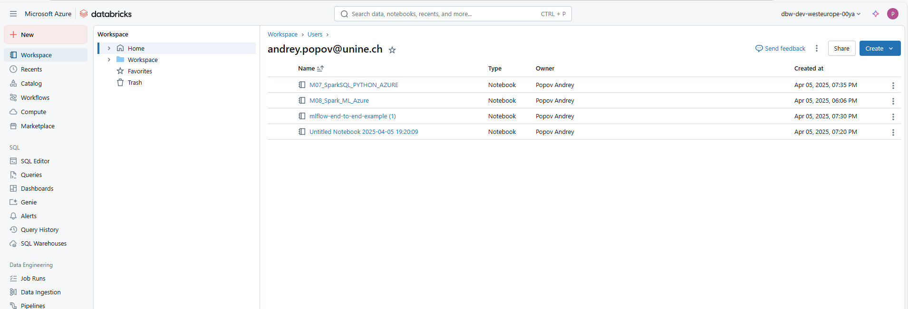

# Path to github repository: https://github.com/Andrey-Vospr/M08_Spark_ML_AZURE

# 🍷 Wine Quality Prediction with MLflow on Azure Databricks

This project walks through a complete machine learning lifecycle on Azure Databricks — including data preprocessing, model training, tracking with MLflow, hyperparameter tuning, batch inference, and model serving — using the Portuguese "Vinho Verde" wine dataset.

---

## 🧭 Project Flow

### 1. Create a Storage Account in Azure for Terraform State

Use the Azure portal or CLI to create a storage account and blob container for storing the Terraform backend state.

---

### 2. Deploy Infrastructure with Terraform

```bash
terraform init                 # (Successfully installed)
terraform plan -out terraform.plan    # (Plan saved)
terraform apply terraform.plan
```

This will provision the required Databricks workspace and resources in Azure.

---

### 3. Launch Notebook `M08_Spark_ML_AZURE` on Databricks Cluster

- Upload and attach the notebook to a running ML cluster (15.4 LTS ML or newer)

---

### 4. Import Notebook and Data into Databricks Cluster



---

### 5. Execute All the Steps from `M08_Spark_ML_AZURE` Notebook

#### 5.1 Merge the two DataFrames into a single dataset, with a new binary feature `is_red`


---

#### 5.2 Visualize the data using Seaborn and Matplotlib

Plot a histogram of the dependent variable, `quality`.


---

#### 5.3 Build box plots to determine feature correlations with wine quality

Features include: `fixed_acidity`, `volatile_acidity`, `citric_acid`, `residual_sugar`, `chlorides`, `free_sulfur_dioxide`, `total_sulfur_dioxide`, `density`, `pH`, `sulphates`, `alcohol`.


---

#### 5.4 Run a parallel hyperparameter sweep

- Use **Hyperopt** with **SparkTrials**
- Track results with **MLflow**

📌 Observations:
- Higher **alcohol content** correlates positively with quality.
- Higher **density** correlates negatively with quality.

✅ Also checked for missing values (none detected).

---

#### 5.5 Build a Baseline Model

- Model: **Random Forest**
- Logged with **MLflow**
- Feature importance analysis confirms: `alcohol` and `density` are top predictors.

---

#### 5.6 Experiment Result: `wine-quality` Model


---

#### 5.7 Transition the Model to Production

- Registered the best-performing model
- Promoted to `Production` in MLflow Model Registry

---

#### 5.8 Best AUC = **0.92**

- Achieved via hyperparameter-tuned **XGBoost**
- Compared with baseline (AUC = 0.85)

---

#### 5.9 Generate the Parallel Coordinates Plot

- Visualize how different hyperparameters affect performance


---

#### 5.10 Perform Batch Inference on a Delta Table

- Load model as Spark UDF
- Apply to new data in parallel


---

#### 5.11 Serve the Model and Compare Endpoint Predictions

- Deployed model with **Databricks Model Serving**
- Compared predictions from local vs endpoint: ✔️ Match


---

**✅ Done! End-to-end ML pipeline built, tracked, and deployed on Azure Databricks.**

---

## 🔧 Requirements

- Azure Subscription
- Databricks Workspace (Premium or Enterprise)
- Terraform (for infrastructure)
- Python 3.8+
- Databricks Runtime 15.4 ML or higher

Python Libraries:
- `mlflow`
- `xgboost`
- `hyperopt`
- `scikit-learn`
- `pandas`, `numpy`, `seaborn`, `matplotlib`
- `flask` (for model serving interaction)

---

## 🙋 Author

**Popov Andrey**  
University of Neuchâtel · Azure for Students

---
